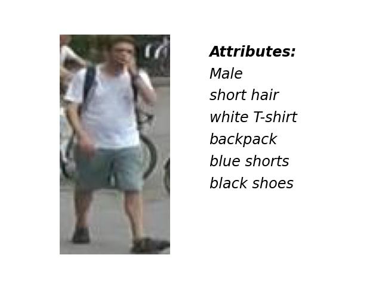

# CA_Market1501 

Here is the official repository for CA_Market1501 attribute dataset. You can find more details on [CA-Market: A Partially Categorical AnnotatingApproach Based on Market1501 Dataset for Attribute Detection](10.1109/ICSPIS54653.2021.9729331)

## About dataset
We have annotate 45 attributes for [Market-1501](http://zheng-lab.cecs.anu.edu.au/Project/project_reid.html). 
The original dataset contains 751 identities for training and 750 identities for testing. 
The attributes are annotated in the image-based level on gt_bbox folder of Market-1501 dataset, 
thus the file contains a CA_Market_with_id.npy
 file with size of 25259 x 46 which includes 45 binary attributes of train and test images of sorted gt_bbox folder from Market-1501 dataset and their id.
The size of train_idx is 12567 and the size of test_idx is 12692. 

The 45 attributes are: 

| attribute | part | column index |
| :----: | :----: | :----: |
 gender | gender |  0
 cap | head | 1 |
 hairless   |   head      |       2|
 short hair |   head       |      3|
 long hair  |   head    |         4|
 knot hair   |  head          |   5|
 head (colorful1, black0)  |    head color    |   6|
 Tshirt/shirt | body | 7|
 coat       |   body     |        8|
 top         |  body             9|
 patterned  |   body type   |     10|
 white      |    body color   |    11|
 red        |   body color   |    12|
 yellow     |   body color   |    13|
 green      |   body color   |    14|
 blue       |   body color   |    15|
 gray       |   body color   |    16|
 purple     |   body color   |    17|
 black      |   body color   |   18|
 backpack   |   bags         |    19 |
 bag        |   bags         |    20|
 no bag    |    bags         |    21|
 pants     |    leg          |    22|
 shorts    |    leg          |    23|
 skirt     |    leg          |    24|
 white     |    leg color    |    25|
 red       |     leg color    |    26|
 brown     |    leg color    |    27|
 yellow    |    leg color    |    28|
 green     |    leg color    |    29|
 blue      |    leg color    |    30|
 gray      |     leg color    |    31|
 purple    |    leg color    |   32|
 black     |    leg color    |    33|
 shoes     |    foot         |    34|
 sandal    |    foot         |    35|
 hidden    |    foot         |    36|
 no color  |    foot color   |    37|
 white     |    foot color   |    38|
 colorful  |    foot color   |    39|
 black     |    foot color   |    40|
 young     |    age          |    41|
 teenager  |    age          |    42|
 adult     |    age          |    43|
 old       |    age          |    44|
 id        |    id           |    45| 
 
 
## Prediction Sample



## How to use
 first download [Market-1501](http://zheng-lab.cecs.anu.edu.au/Project/project_reid.html). 

```
from delivery import data_delivery

main_path = './datasets/Market1501/Market-1501-v15.09.15/gt_bbox/'
path_attr = './attributes/CA_Market_with_id.npy'

attr = data_delivery(main_path = main_path,
              path_attr = path_attr,
              need_id = True,
              need_parts = True,
              need_attr = False)
``` 
The output of data_delivery would be a python dictionary. 
If you set need_id True, it will include ids. If set need_parts True, it will include 11 key and value which are attributes for each part of dataset.
If set need_attr = True, it will include a key 'attributes', a vector with size of (25259, 45) which is all attributes together.  
## Citation

If you use this dataset in your research, please kindly cite our work as,
```
@article{
CA-Market: A Partially Categorical AnnotatingApproach Based on Market1501 Dataset for Attribute Detection
}
```
CA_Market1501 Dataset:
```
@inproceedings{bodaghi2021market,
  title={CA-Market: A Partially Categorical AnnotatingApproach Based on Market1501 Dataset for Attribute Detection},
  author={Bodaghi, Hossein and Samiee, Shayan and Masoulehe, Mehdi Tale and Kalhor, Ahmad},
  booktitle={2021 7th International Conference on Signal Processing and Intelligent Systems (ICSPIS)},
  pages={01--08},
  year={2021},
  organization={IEEE}
}
```

